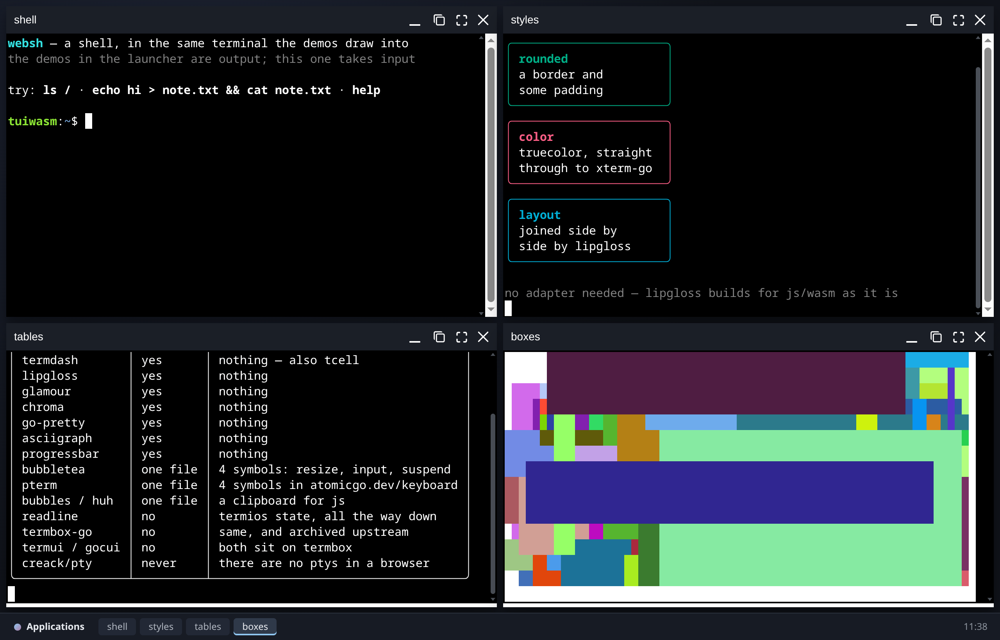
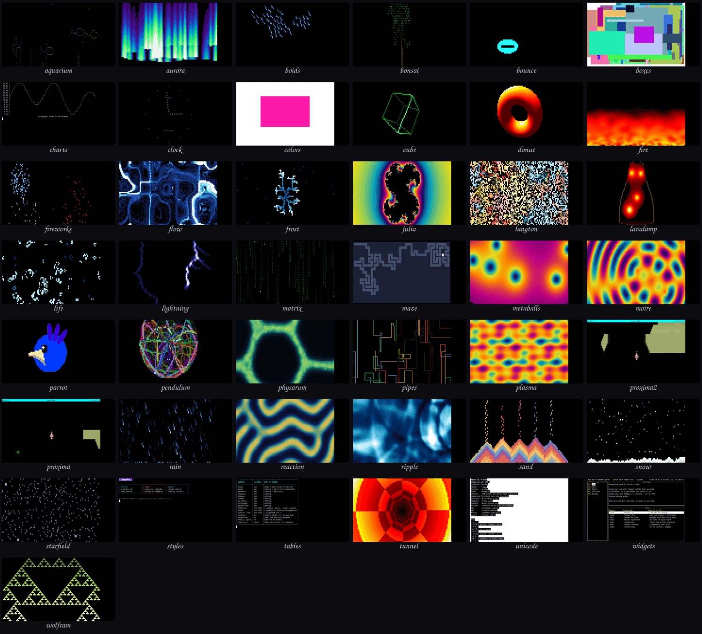
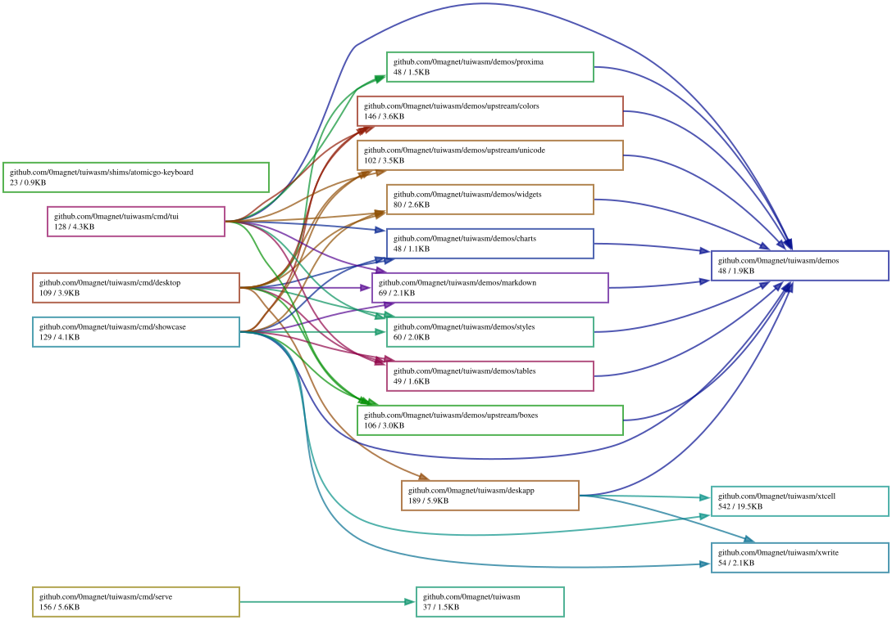

# tuiwasm

Go terminal-UI libraries running in the browser, on top of
[xterm-go](https://github.com/0magnet/xterm-go).

**[Live demo](https://tuiwasm.magnetosphere.net/)** (standard Go build) ·
**[TinyGo build](https://tuiwasm.magnetosphere.net/tinygo/)** — smaller; see
Building and serving below.





Forty-three demos, every one of them a frame captured from the running browser
build: thirty-four animations from
[termanim](https://github.com/0magnet/termanim), tcell's own demos, and the
tview, lipgloss and pterm ones written here.

The libraries are other people's; what is here is the small amount of glue each
one needs to work in a browser, and demos that show it working. Nothing in
[websh](https://github.com/0magnet/websh) or
[desk](https://github.com/0magnet/desk) depends on this repo — the dependency
runs the other way, so neither of them pays for a library it does not use.

## xtcell

`xtcell` makes a tcell program draw into an xterm-go terminal.

tcell has two screens and the build tags choose between them. `tscreen.go`, the
terminfo one that speaks ANSI to a tty, is built with `!(js && wasm)` and so
does not exist in a browser. What does exist is `wscreen.go`, which paints by
calling functions it expects on the JavaScript global object:

```
Go -> JS   drawCell(x, y, s, fg, bg, attrs, us, uc)   clearScreen(fg, bg)
           show()   showCursor(x, y)   setCursorStyle(class, color)
           resize(w, h)   beep()   setTitle(t)

JS -> Go   onKeyEvent(key, shift, alt, ctrl, meta)
           onMouseClick   onMouseMove   onFocus   onPaste
```

tcell ships a `tcell.js` implementing the first list against a DOM grid of its
own. `xtcell` implements the same list against an xterm-go terminal, by
translating each call into the escape sequence a real program would write —
xterm-go is a terminal emulator, so it already knows what to do with them.

```go
term := xterm.New(vt.NewOptions())   // not &vt.Options{} — see below
term.Open(container)
term.AutoFit()

bridge := xtcell.Attach(term)   // before NewScreen: tcell calls these in Init
defer bridge.Detach()

screen, _ := tcell.NewScreen()
screen.Init()
bridge.Bind(screen)             // real size, and follow it

go boxes.Run(screen)            // PollEvent blocks; the page has one goroutine
select {}
```

Because `tview` and `termdash` are written against `tcell.Screen`, they come
along for free.

### Two things worth knowing

**Input does not come through xterm-go.** Its `OnData` gives what a terminal
sends to a pty (`"\x1b[A"` for up-arrow); tcell's `onKeyEvent` wants the other
end of that — a DOM `KeyboardEvent.key` name and four modifier booleans — and
the conversion is lossy, since `"\x03"` cannot say whether it was ctrl-C or a
literal ETX. Keystrokes are therefore read from a `keydown` listener, which is
where `tcell.js` reads them too, and xterm-go's encoded copy is suppressed
while a tcell program is running.

**tcell's web screen is 80x24 until told otherwise.** `wscreen.Init` hardcodes
it and gives the page no way to report a size, so `Bind` pushes the real one in
through `SetSize` and keeps it current from xterm-go's resize.

**Build the terminal with `vt.NewOptions()`.** The zero value of `vt.Options`
has a `FontSize` and `LineHeight` of 0, so a cell measures 0x0 and `AutoFit`
divides the window by that to decide how many rows and columns fit. The page
does not fail — it wedges, pinning the renderer while it lays out an unbounded
grid, which from outside is indistinguishable from the wasm never loading.

## xwrite

Most of these libraries never need a `tcell.Screen`. lipgloss, glamour,
chroma, go-pretty, pterm and asciigraph write styled text to an `io.Writer`
and nothing more, so they need no adapter beyond somewhere to write. `xwrite`
is that, and its one real job is line endings: a program writing to a pipe
ends a line with `"\n"`, but a terminal reads that as "down one row" and
nothing else, so without the carriage return the output staircases off to the
right. A lone `"\r"` is passed through, because that is how a progress bar
redraws in place.

## Demos

Every name below is a link to that demo with the page to itself. They are all
the **same page and the same `.wasm`** — `?demo=` picks one out of the registry
at startup — so a link to one costs nothing to serve and there is no per-demo
build. The full-page view has no chrome at all: it should look like the terminal
it would run in, and the browser already has a back button.

`pterm` is not listed: it needs `-tags pterm`, see `shims/`. Neither is
`markdown`, which needs `-tags tuimarkdown` — glamour and chroma are a couple
of megabytes for one demo. Build gendemos with the same tags as the binary and
both appear; the table describes the build it was generated from, never a
build nobody ships.

<!-- BEGIN DEMOS -->
| demo | shape | what it is |
| --- | --- | --- |
| [`aquarium`](https://tuiwasm.magnetosphere.net/?demo=aquarium) | screen | fish swimming past swaying seaweed |
| [`aurora`](https://tuiwasm.magnetosphere.net/?demo=aurora) | screen | curtains of light, folding, with the creases where they turn |
| [`boids`](https://tuiwasm.magnetosphere.net/?demo=boids) | screen | flocking by separation, alignment and cohesion |
| [`bonsai`](https://tuiwasm.magnetosphere.net/?demo=bonsai) | screen | a bonsai tree growing branch by branch |
| [`bounce`](https://tuiwasm.magnetosphere.net/?demo=bounce) | screen | the screensaver logo, and the wait for it to hit a corner |
| [`boxes`](https://tuiwasm.magnetosphere.net/?demo=boxes) | screen | tcell's own boxes demo — random boxes, timed |
| [`charts`](https://tuiwasm.magnetosphere.net/?demo=charts) | text | asciigraph — a line plot in cells |
| [`clock`](https://tuiwasm.magnetosphere.net/?demo=clock) | screen | an analog clock, after aclock |
| [`colors`](https://tuiwasm.magnetosphere.net/?demo=colors) | screen | tcell's own colors demo — boxes cycling through the palette |
| [`cube`](https://tuiwasm.magnetosphere.net/?demo=cube) | screen | a rotating wireframe solid, shaded by depth |
| [`donut`](https://tuiwasm.magnetosphere.net/?demo=donut) | screen | a lit torus with a z-buffer |
| [`fire`](https://tuiwasm.magnetosphere.net/?demo=fire) | screen | a heat grid seeded with noise and cooled upward |
| [`fireworks`](https://tuiwasm.magnetosphere.net/?demo=fireworks) | screen | shells that rise, burst and droop into willows |
| [`flow`](https://tuiwasm.magnetosphere.net/?demo=flow) | screen | particles carried through a divergence-free curl-noise field |
| [`frost`](https://tuiwasm.magnetosphere.net/?demo=frost) | screen | a crystal growing by diffusion-limited aggregation |
| [`julia`](https://tuiwasm.magnetosphere.net/?demo=julia) | screen | a Julia set morphing as its parameter walks the cardioid |
| [`langton`](https://tuiwasm.magnetosphere.net/?demo=langton) | screen | Langton's ants: chaos, then the highway |
| [`lavalamp`](https://tuiwasm.magnetosphere.net/?demo=lavalamp) | screen | wax that heats, rises, cools and sinks |
| [`life`](https://tuiwasm.magnetosphere.net/?demo=life) | screen | Conway's life, colored by how long a cell has lived |
| [`lightning`](https://tuiwasm.magnetosphere.net/?demo=lightning) | screen | a branching discharge: leader, return stroke, afterglow |
| [`matrix`](https://tuiwasm.magnetosphere.net/?demo=matrix) | screen | falling columns of glyphs |
| [`maze`](https://tuiwasm.magnetosphere.net/?demo=maze) | screen | a maze carved by backtracking, then solved |
| [`metaballs`](https://tuiwasm.magnetosphere.net/?demo=metaballs) | screen | blobs that bulge and merge as they approach |
| [`moire`](https://tuiwasm.magnetosphere.net/?demo=moire) | screen | two drifting ripples interfering |
| [`parrot`](https://tuiwasm.magnetosphere.net/?demo=parrot) | screen | the party parrot, rolling once around the hue wheel |
| [`pendulum`](https://tuiwasm.magnetosphere.net/?demo=pendulum) | screen | double pendulums released together, shearing apart |
| [`physarum`](https://tuiwasm.magnetosphere.net/?demo=physarum) | screen | slime mold laying trails and building a transport network |
| [`pipes`](https://tuiwasm.magnetosphere.net/?demo=pipes) | screen | pipes growing and turning, with correct elbows |
| [`plasma`](https://tuiwasm.magnetosphere.net/?demo=plasma) | screen | summed sine waves of position, offset by time |
| [`proxima`](https://tuiwasm.magnetosphere.net/?demo=proxima) | screen | Escape from Proxima 5 — gdamore's tcell space shooter |
| [`proxima2`](https://tuiwasm.magnetosphere.net/?demo=proxima2) | screen | Escape from Proxima 5 on tcell v2 — the same game, one major back |
| [`rain`](https://tuiwasm.magnetosphere.net/?demo=rain) | screen | drops with depth, slant, streaks and splashes |
| [`reaction`](https://tuiwasm.magnetosphere.net/?demo=reaction) | screen | Gray-Scott reaction-diffusion: spots that divide into a labyrinth |
| [`ripple`](https://tuiwasm.magnetosphere.net/?demo=ripple) | screen | a ripple tank: rain falling, rings meeting and interfering |
| [`sand`](https://tuiwasm.magnetosphere.net/?demo=sand) | screen | grains heaping at their angle of repose |
| [`snow`](https://tuiwasm.magnetosphere.net/?demo=snow) | screen | flakes that sway, settle and drift into banks |
| [`starfield`](https://tuiwasm.magnetosphere.net/?demo=starfield) | screen | stars streaming past the viewer |
| [`styles`](https://tuiwasm.magnetosphere.net/?demo=styles) | text | lipgloss — borders, color, alignment |
| [`tables`](https://tuiwasm.magnetosphere.net/?demo=tables) | text | go-pretty — the wasm compatibility matrix |
| [`tunnel`](https://tuiwasm.magnetosphere.net/?demo=tunnel) | screen | flying down a textured tube |
| [`unicode`](https://tuiwasm.magnetosphere.net/?demo=unicode) | screen | tcell's own unicode demo — wide, combining and emoji glyphs |
| [`widgets`](https://tuiwasm.magnetosphere.net/?demo=widgets) | screen | tview — a flexbox of lists, tables and text views on tcell v2 |
| [`wolfram`](https://tuiwasm.magnetosphere.net/?demo=wolfram) | screen | elementary cellular automata scrolling upward - 30, 90, 110 |
<!-- END DEMOS -->

The table is generated from the registry by `go run ./cmd/gendemos`; a list of
what exists, kept by hand beside the thing that knows, is a list that is wrong.

A demo declares which shape it is and nothing else. It never learns whether it
is in a browser, in websh, or in a real terminal — one takes an `io.Writer`,
the other a `tcell.Screen`, and both exist everywhere. Importing the package
registers it; that is all of wiring one up.

## The desk

`cmd/desktop` puts them on a [desk](https://github.com/0magnet/desk), one demo
to a window, each with its own terminal. Several libraries drawing at once is
what the collection is for — that reads better as four windows than as four
URLs — and it also settles the question of how to ship them, since there is
one page and one binary rather than a menu.

The opening four are tiled rather than cascaded. Cascading is right for a
desktop, where you work in one window at a time; here three of the four would
be a title bar.

**The tcell windows take turns.** tcell's wasm screen reaches the page through
global function names and installs its own `onKeyEvent` among them, so a second
screen's `Init` overwrites the first's and the keyboard would follow whichever
initialized last. What makes several windows workable is that tcell already
knows how to step aside: `Suspend` unsets its `onKeyEvent`, `Resume` puts it
back. Clicking a window calls `Claim`, which suspends whoever held the globals
and resumes this one. A suspended screen gets no events, blocks in `PollEvent`
and stops drawing, so it cannot paint into someone else's terminal.

Text demos have no such limit — they write to their own terminal and share
nothing, so any number can be open.

`cmd/showcase` is still there for one demo to a page, with `?demo=name`.

## Layout

```
xtcell/      the tcell adapter; ansi.go is pure Go and tested natively
xwrite/      xterm-go as an io.Writer; also tested natively
demos/       one package per demo, plus the registry
shims/       files that belong in someone else's module
cmd/desktop  all demos, windowed — what the site serves
cmd/showcase one demo per page, with ?demo=name
cmd/serve    a native binary that serves the built site, embedded
embed.go     embeds docs/, so the server needs no checkout
docs/        the committed build: TinyGo at the root, Go in go/
```

`ansi.go` and `writer.go` hold everything interesting and import nothing from
`syscall/js`, so `go test ./...` runs it on a normal machine.

## Size

GitHub Pages serves `application/wasm` with `content-encoding: gzip` without
being asked, so compression needs no configuration at all:

```
$ curl -sI -H 'accept-encoding: gzip' https://xterm-go.magnetosphere.net/main.wasm
content-type: application/wasm
content-encoding: gzip
content-length: 302238        # 867902 uncompressed
```

The binary is 21M, and 4.4M on the wire. Most of it is chroma, which embeds a
lexer for every language it knows and is 13M of source on its own — the demos
without it come to 7.1M.

Splitting per demo would not help. Every binary carries the Go runtime and
xterm-go before a single demo is linked in, which measures 3.8M raw and 1.0M
gzipped, so two binaries pay that twice and cost 4.1M *more* in total than one
does. It buys a smaller first load for a visitor who opens one demo and leaves,
and costs everyone who opens two. On a page whose point is clicking through
several, one binary is the right trade.

## Building and serving

```sh
./build.sh                  # both toolchains -> docs/ and docs/go/
./build.sh tinygo           # TinyGo only
./build.sh go               # standard Go only

go run ./cmd/serve          # serve the built demo, open a browser
```

Both toolchains are carried, and their loader shims are not interchangeable,
so each build gets its own.

Both builds work. The standard Go build is at the root because it is the one
that has always worked; the TinyGo build, a third of the size, is a click away.

The TinyGo one was broken for a long time and the story is worth keeping. It
grew its linear memory to 3.44GB during package initialization — grown, not
declared; the module asks for 3.6MB — and all of it came from a per-cell
`js.Value.String()` in xtcell's old `drawCell`. Rewriting that path removed the
cause, and it now settles around 830MB.

Above 2GB it also met a separate bug in TinyGo's shim, which is worth knowing
about even though this build no longer reaches it: wasm32 pointers are `i32`,
JavaScript sees an `i32` as signed, and `wasm_exec.js` never coerces one back,
so the first pointer past 2GB arrives as `-2146545368` — `2148421928` unsigned,
a byte well inside the buffer — and every `DataView` write throws. That is
[tinygo-org/tinygo#5621](https://github.com/tinygo-org/tinygo/issues/5621), with
a sibling leak in the same shim at
[#5622](https://github.com/tinygo-org/tinygo/pull/5622). Neither is in a
released TinyGo yet. See the fuller note in `build.sh`.

`docs/` is committed rather than built on demand, because `embed.go` embeds
it: the serve command is one binary with nothing to host and nothing to
fetch, and works with no network and no checkout. Nobody else pays for that —
Go drops an embedded file set that nothing reads, so importing this package
for anything else does not carry the wasm.

The server serves what Pages serves, the way Pages serves it: same layout,
and gzip on the wasm, so a local try is not several times heavier than the
real thing. `--no-gzip` turns that off to see the uncompressed cost.
## Dependency Graph

Made with [goda](https://github.com/loov/goda):

```
# GOOS=js: the import edges of a wasm program live in js/wasm-tagged
# files and are invisible to a host-context run
GOOS=js GOARCH=wasm go run github.com/loov/goda@latest graph github.com/0magnet/tuiwasm/... | dot -Tsvg -o docs/tuiwasm-goda-graph.svg
```



## Lines of Code

Made with [gocloc](https://github.com/hhatto/gocloc) (excludes `vendor/`, `node_modules/`, `.git/`):

```
gocloc --not-match-d='(vendor|node_modules|\.git)' .
```

```
-------------------------------------------------------------------------------
Language                     files          blank        comment           code
-------------------------------------------------------------------------------
Go                              39            519           1023           2907
JavaScript                       2            117             82            935
Markdown                         3             91              2            314
HTML                             2              0              7            114
YAML                             1              0             12            100
Makefile                         1             19             31             86
Bourne Shell                     2             14             49             52
-------------------------------------------------------------------------------
TOTAL                           50            760           1206           4508
-------------------------------------------------------------------------------
```
